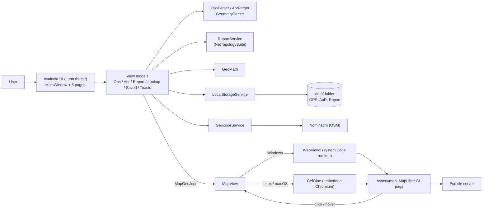

# UAS Tool

Portable desktop viewer for UAS flight operation plans (OPS) and areas of responsibility (AoRs), built with Avalonia UI on .NET. The window title and sidebar header read "UAS Tool — UAV Flight Plan Viewer".

This document is technical (architecture, build, deployment). For what the app does and how to use it, see [USER_GUIDE.md](USER_GUIDE.md).

## Overview

The application loads OPS and AoR data from JSON files, draws the resulting polygons on an interactive map, and lets the user filter, inspect, cross-reference and export that data. It runs entirely on the local machine: there is no server, database or user account. Network access is used only for map tiles and for address geocoding (see [External Services](#external-services)).

Primary capabilities:

- Load OPS and AoR JSON files and show their geometry on a map.
- Filter and search OPS by text, closure reason and date range.
- Report which OPS intersect a chosen AoR.
- Find OPS within a radius of an address or coordinate.
- Export selections to JSON or XLSX.
- Keep a local copy of every upload and report export, with archive/restore/delete.

The code in this repository is a native port of an earlier React/Vite web application, which has been removed from the repository. Parsing rules, geodesic math (area, circle, distance, centroid) and filtering behaviour were ported from it, and `Services/GeoMath.cs` documents which formulas match the web app's turf.js output.

## Features

### Implemented

| Area | Behaviour |
| --- | --- |
| **OPS tab** | Upload JSON; search by title, ID, operator and description; closure-reason chips; From/To date filter (defaults to the overall time range of the loaded file); select all; delete one or selected; details panel; export selected to JSON or XLSX. |
| **AoRs tab** | Upload JSON; search by name, designator, ID, message, restriction and reasons; select all; delete one or selected; details panel (restriction, message, applicability times, vertical limits, auto-reject setting); export selected to JSON or XLSX. |
| **Report tab** | Searchable AoR picker; live count and list of OPS intersecting the chosen AoR (against the OPS tab's *current* filters); export a per-AoR match-count table to JSON or XLSX. |
| **Lookup tab** | Resolve a `lat, lon` / `lat:lon` / `lat lon` string or an address (Nominatim); radius from a text box or presets (0.5, 1, 2, 5, 10 km); list and export OPS within the radius. |
| **Map** | Shows the active tab's shapes (OPS, AoRs, report result, or lookup radius plus matches); highlights selected, active and hovered items; hover popup; clicking a shape activates it in the sidebar. |
| **Saved Locally** | Every OPS/AoR upload and every report export is written under a `data` folder. A dedicated "Saved Locally" page lists them by category to reload (OPS/AoR, which switches to that tab), archive, restore and delete, singly or in bulk; deletes need a second confirmation click that states the consequence. |
| **Interface ("Luna" theme)** | Dark theme with a purple accent: header showing the current section and real data counts, navigation rail with count badges, glass panels, cards with status pills, inspector-style detail panels, empty and loading states, compact self-dismissing notifications for uploads, exports, warnings, errors and file actions. All colours, radii, spacing, icons and control styles are centralised in `Styles/`. |
| **Input formats** | OPS: a single plan object, an array, or an object with a `plans`, `operations` or `flight_plans` array; both camelCase and snake_case field names. AoR: two schemas (a "responsibility area" schema and an airspace-zone schema with Circle/Polygon/MultiPolygon projections); entries that cannot be parsed are skipped and counted in a warning. |

### Partially implemented

- **Linux/macOS map** uses embedded Chromium (CEF). It compiles and publishes, but has not been verified on a real Linux or macOS desktop (see [Known Limitations](#known-limitations)).

### Planned

Not documented in the repository.

## Architecture

MVVM application. Each tab has a view model; `MainViewModel` coordinates them and produces the data pushed to the map. The map is an HTML page (MapLibre GL JS) hosted in a web view.



Data flow for the map: view-model changes raise `MapDataInvalidated` / `MapHighlightsInvalidated` on `MainViewModel`; `MainWindow` debounces them (150 ms / 50 ms) and calls `MapView.UpdateData` / `UpdateHighlights`, which post the GeoJSON or highlight IDs to the page. The page reports clicks and hovers back, and `MainViewModel.HandleMapZoneClicked` / `HandleMapZoneHovered` update the sidebar.

## Technology Stack

Versions are taken from `avalonia-app/FlightPathPlanner/FlightPathPlanner.csproj` and `avalonia-app/FlightPathPlanner.Tests/FlightPathPlanner.Tests.csproj`.

| Component | Technology | Version | Purpose |
| --- | --- | --- | --- |
| Runtime | .NET | `net10.0` (SDK 10.0.401 used during development) | Application and tests |
| UI framework | Avalonia (+ Fluent theme, Inter font) | 11.3.22 | Cross-platform desktop UI |
| MVVM | CommunityToolkit.Mvvm | 8.4.2 | Observable properties, commands |
| Map page | MapLibre GL JS (bundled in `Assets/map`) | 5.16.0 (from file header) | Map rendering |
| Web view (Windows) | Microsoft.Web.WebView2 | 1.0.4191.47 | Hosts the map page using the system Edge runtime |
| Web view (Linux/macOS) | CefGlue.Next.Avalonia | 152.7977.83 | Hosts the map page in embedded Chromium |
| Geometry | NetTopologySuite | 2.6.0 | Polygon intersection tests |
| Spreadsheet export | ClosedXML | 0.105.1 | XLSX export |
| Tests | xUnit / Microsoft.NET.Test.Sdk / coverlet.collector | 2.9.3 / 17.14.1 / 6.0.4 | Unit tests |
| Database, backend, auth | — | — | None |

## Project Structure

```text
.
├── README.md
├── .gitignore
└── avalonia-app/
    ├── FlightPathPlanner.slnx              # Solution (app + tests)
    ├── FlightPathPlanner/                  # The application
    │   ├── Program.cs                      # Entry point, crash logging, CEF start-up (non-Windows)
    │   ├── App.axaml(.cs)                  # Application; Fluent dark theme recoloured to the Luna accent
    │   ├── Styles/                         # Luna design system
    │   │   ├── LunaTokens.axaml            # Colours, gradients, shadows, spacing, radii, control heights, opacity, type scale
    │   │   ├── LunaIcons.axaml             # One family of 24x24 line icons
    │   │   └── LunaStyles.axaml            # Buttons, inputs, chips, cards, glass panels, pills, toasts, text styles
    │   ├── Controls/LunaIcon.cs            # Monochrome line-icon control
    │   ├── Models/                         # OPS, AoR and geometry models
    │   ├── Services/
    │   │   ├── OpsParser.cs, AorParser.cs, GeometryParser.cs, JsonHelpers.cs   # Tolerant JSON parsing
    │   │   ├── GeoMath.cs                  # Area, circle, destination, distance, centroid
    │   │   ├── ReportService.cs            # Intersection queries (AoR match, radius match)
    │   │   ├── MapGeoJson.cs               # Builds the FeatureCollection the map page consumes
    │   │   ├── GeocodeService.cs           # Coordinate parsing + Nominatim lookup
    │   │   ├── LocalStorageService.cs      # data/ folder, archive, restore, delete
    │   │   ├── MapAssets.cs                # Unpacks the embedded map page for the web view
    │   │   └── Notifier.cs                 # User-feedback events (success/info/warning/error)
    │   ├── ViewModels/                     # MainViewModel and per-tab view models
    │   ├── Views/                          # Window shell, tab views, SavedTabView/SavedFilesPanel, MapView, WebView2Host, FileDialogs
    │   ├── Assets/luna.ico                 # Application/window icon
    │   ├── Assets/map/                     # index.html, map.js, bundled MapLibre GL JS/CSS (embedded in the assembly)
    │   ├── SetStackSize.targets            # Windows build step (see Known Limitations)
    │   └── FlightPathPlanner.csproj
    └── FlightPathPlanner.Tests/            # xUnit tests
```

`.claude/` may exist locally but is not tracked.

## Prerequisites

| Need | Detail |
| --- | --- |
| .NET SDK | 10.x (the projects target `net10.0`). Only needed to build/run from source; published builds are self-contained. |
| Windows | Microsoft Edge **WebView2 Runtime** (preinstalled on current Windows 10/11; otherwise install from Microsoft). Without it the map area shows an install message and the rest of the app works. No Visual Studio is required. |
| Linux / macOS | No extra packages are declared in the repository. System libraries required by Chromium are **Not documented**. |
| Internet | Needed for map tiles and address lookup. |

## Installation

```bash
git clone https://github.com/Win1817/flight-path-planner.git
cd flight-path-planner/avalonia-app
dotnet restore
```

## Configuration

There are no configuration files. The only environment variable read by the code is:

| Variable | Required | Description | Example |
| --- | --- | --- | --- |
| `FPP_NO_MAP` | No | `1` skips creating the map view (and CEF on Linux/macOS) and shows "Map disabled". Useful to run the tabs if the map cannot start. | `FPP_NO_MAP=1` |

Other constants live in code:

- Basemap tile URLs and attribution: constants at the top of `Assets/map/map.js` (embedded; rebuild after editing).
- Data folder: see [Local Data](#local-data).

## Running the Application

### Development

```bash
cd avalonia-app
dotnet run --project FlightPathPlanner
```

PowerShell, map disabled:

```powershell
$env:FPP_NO_MAP = "1"
dotnet run --project FlightPathPlanner
```

### Production build (portable)

**Windows `.exe`** (one file, icon included, no installer, no .NET needed on the target machine). From `avalonia-app/`:

```powershell
.\publish-windows.ps1
```

This runs the publish command below for `win-x64` and writes `dist\win-x64\FlightPathPlanner.exe` (about 52 MB). The map page is embedded in the executable and is unpacked on first start to `%LOCALAPPDATA%\UasTool\map-assets\<build id>` (older builds' folders are removed). The file icon (`Assets/luna.ico`, 16-256 px) is embedded via `ApplicationIcon`.

**Any platform** — self-contained single-file publish, run from `avalonia-app/`. Replace `<rid>` with `win-x64`, `linux-x64`, `osx-x64` or `osx-arm64`:

```bash
dotnet publish FlightPathPlanner -c Release -r <rid> --self-contained true \
  -p:PublishSingleFile=true -p:IncludeNativeLibrariesForSelfExtract=true -o dist/<rid>
```

Measured output when publishing from a Linux host (before the map page was embedded; Linux/macOS sizes are dominated by Chromium):

| Runtime | Output size | Contents |
| --- | --- | --- |
| `win-x64` | ~52 MB | `FlightPathPlanner.exe` only |
| `linux-x64` | ~396 MB | Executable, `Resources/`, CEF `.so` files and support files (~238 files) |
| `osx-x64` | ~385 MB | Executable, CEF framework and helper `.app` bundles (~250 files) |
| `osx-arm64` | ~373 MB | Same layout as `osx-x64` (~250 files) |

The published Windows executable was inspected for its icon and subsystem (Windows GUI) but has **not been run** on Windows by the author of this document. Running the published output of the other targets has **not been verified**. `dist/` is git-ignored.

### Production run

Run the published executable directly (`FlightPathPlanner.exe` on Windows, `FlightPathPlanner` elsewhere). No installer is used.

### Docker / Docker Compose

Not present in this repository.

## Application Usage

1. Open the **OPS** tab and choose **Upload OPS JSON**. The plans are listed and drawn on the map; the date range defaults to the file's overall range.
2. Narrow the list with the search box, closure-reason chips and From/To dates. Click a card (or a shape on the map) to open its details.
3. Tick cards and use **Export JSON** / **Export XLSX** in the footer to save the selection through the system file dialog.
4. Open **AoRs** and upload an AoR JSON file. Select, inspect and export AoRs the same way.
5. With both files loaded, open **Report**, pick an AoR, and see which OPS (within the OPS tab's current filters) intersect it. **Export** writes a match count for every AoR.
6. Open **Lookup**, enter a coordinate or address, choose a radius, and review/export the OPS inside the circle. If an address returns several candidates, pick one.
7. Open **Saved Locally** (bottom of the navigation rail) to reload an earlier upload (this jumps to the OPS or AoRs tab), archive or restore files, or delete them.
8. Uploads, exports, warnings, errors and file actions are confirmed by short notifications at the top of the sidebar panel.

## Large Datasets

GeoZone / AoR (and OPS) files with tens of thousands of records import without freezing the window:

- **Streaming import** – files are read as a stream and parsed one record at a time on a background thread (`Services/Import`). Malformed records are skipped and counted; all supported schemas still work.
- **Progress and cancel** – stage, counts, percentage, elapsed time and ETA are shown; Cancel leaves existing data untouched. Files over 40 MB show a heads-up before importing (never rejected).
- **Virtualised lists and debounced search** – rows are created lazily; search runs off the UI thread on a precomputed index (250 ms debounce).
- **Viewport map rendering** – above 1,500 shapes the map only receives what is in view (NetTopologySuite STRtree), sent as chunked, coordinate-rounded GeoJSON; zoom in to see more. Diagnostics are appended to `import.log` next to the executable.
- **Benchmarks** – `FPP_BENCH=1 dotnet test --filter ImportBenchmarkTests`; `FPP_GEN=<dir>` writes sample 1k/25k/50k zone files.

Measured on a 25,000-zone (58 MB) file: import ~3 s in the background with 54 progress updates; UI kept ticking (max stall 325 ms vs. a 5 s freeze with the previous blocking path); peak working set ~500 MB.

## Local Data

`LocalStorageService` writes plain files:

```text
data/
├── OPS/      <UTC timestamp>__<name>.json   (Archive/ subfolder for archived files)
├── AoR/
└── Report/
```

- Location: `data/` next to the executable (keeps the app portable). If that folder is not writable, it falls back to `UasTool/data` under the user's local application data folder (`%LOCALAPPDATA%\UasTool\data` on Windows).
- File names are sanitised (characters illegal on Windows are replaced) and prefixed `yyyy-MM-ddTHH-mm-ss-fffZ__`.
- Uploads are saved only after they parse successfully; reloading a saved file does not create another copy.
- Report exports are saved as JSON regardless of the export format chosen.

Other files written next to the executable: `crash.log` (unhandled .NET exceptions), `map.log` (map diagnostics), `cef.log` (CEF only, Linux/macOS). On Windows, WebView2 keeps its profile in `%LOCALAPPDATA%\UasTool\WebView2`.

## External Services

| Service | Used for | Where |
| --- | --- | --- |
| Esri "World Dark Gray" base and reference tiles (`server.arcgisonline.com`) | Basemap | `Assets/map/map.js` |
| OpenStreetMap Nominatim (`nominatim.openstreetmap.org`) | Address search on the Lookup tab | `Services/GeocodeService.cs` |

Both require internet access and are subject to their providers' terms of use. Review them before wider distribution.

## API, Authentication, Database

Not applicable: the application exposes no API, has no login or roles, and uses no database. Data is read from user-selected JSON files and written to the local `data/` folder.

## Testing

xUnit tests live in `avalonia-app/FlightPathPlanner.Tests` (79 tests at the time of writing) and cover geodesic math, OPS/AoR parsing, coordinate parsing, intersection queries, map GeoJSON output and map coordination, local storage, the tab/saved-files view models, and the shell state (header text, navigation badges, notifications, toast queue). There are no integration or end-to-end UI tests; the visual design was checked by screenshots only.

```bash
cd avalonia-app
dotnet test
```

`coverlet.collector` is referenced, so coverage can be collected with the standard collector option (`dotnet test --collect:"XPlat Code Coverage"`); no coverage threshold or report tooling is configured.

## Code Quality

No linter, formatter configuration (`.editorconfig`), static-analysis, or pre-commit hook configuration is present. Nullable reference types and implicit usings are enabled in both projects.

## Build and Deployment, CI/CD

No CI/CD pipeline, container, Kubernetes or Helm configuration exists in the repository. Distribution is by copying the published folder (see [Production build](#production-build-portable)).

Build notes derived from `FlightPathPlanner.csproj`:

- CEF is a dependency only for non-Windows targets (`UseCef`); Windows builds exclude Chromium entirely.
- For Linux/macOS, the build host's runtime identifier is used by default so CEF's native files are copied next to the output; publishes copy them into the publish folder.
- Release builds drop debug symbols and third-party XML documentation files and compress the single-file bundle.

## Security Considerations

Confirmed from the code:

- The app has no network listener and no accounts; input is local JSON files chosen by the user. Parsing failures are caught and reported rather than crashing.
- Text shown in map popups is HTML-escaped (`escapeHtml` in `map.js`).
- On Windows, the map page is served from a WebView2 virtual host (`appassets.local`) mapped to the unpacked map-page folder only.
- Saved-file operations reject names containing path separators or `..` and re-derive paths from the category and name.
- **Chromium sandbox is disabled** for the embedded browser on Linux/macOS (`NoSandbox = true` in `Program.cs`). It is loaded only with the bundled map page and tile images, but this is a deliberate reduction in isolation.
- Address searches send the typed text to Nominatim.

No dependency scanning, secret management or audit logging is configured.

## Troubleshooting

**Problem** — On Windows the map area shows a message about the WebView2 Runtime.
**Cause** — The Edge WebView2 Runtime is not installed.
**Solution** — Install the runtime from Microsoft's WebView2 page; the rest of the app works without it.

**Problem** — The map is blank or shows a JavaScript error text at its top-left.
**Cause** — The page failed to start (for example WebGL unavailable) or the map page could not be unpacked to `%LOCALAPPDATA%\UasTool\map-assets`.
**Solution** — Read `map.log` and check that folder is writable. To use the tabs without the map, set `FPP_NO_MAP=1`.

**Problem** — The map is dark with no basemap.
**Cause** — No internet access, or the tile provider is unreachable/blocked.
**Solution** — Restore connectivity, or change the tile constants in `Assets/map/map.js`.

**Problem** — The app closes at start-up without a window.
**Cause** — An unhandled exception (a WinExe has no console).
**Solution** — Read `crash.log` next to the executable.

**Problem** — Address search fails.
**Cause** — No internet, or Nominatim rejected/limited the request.
**Solution** — Retry, or enter coordinates (`lat, lon`), which are parsed locally without a network call.

## Development Guidelines

The repository does not document branching, commit, review or environment conventions. Work is on `main`. Run `dotnet build` and `dotnet test` from `avalonia-app/` before committing. When changing the map page, keep `map.js` working with both bridges (WebView2 `postMessage` and CEF `window.csharpBridge`).

## Contributing

No contribution guidelines are present in the repository.

## License

No license file is currently provided in this repository.

## Known Limitations

Technical
- The Windows map depends on the system WebView2 Runtime. CEF was not usable on the machine used for Windows testing (its helper processes crashed inside `libcef.dll`), which is why Windows does not use it.
- Linux/macOS use CEF, which could not be exercised in the development container (it crashed during start-up there), and published Linux/macOS builds have not been run on real desktops. macOS packaging (helper app bundles, code signing) is **Not confirmed**.
- Windows builds run `SetStackSize.targets`, which sets an 8 MiB stack reserve in the app host. It was added for CEF's helper processes; whether the Windows WebView2 path still needs it is **Not confirmed**.

Incomplete features
- The map page's Luna styling (glass zoom controls, popups, lavender selection outline) could not be viewed in this project's development environment; only the desktop shell was verified visually. **Not confirmed** on a real display.
- No custom modal dialogs exist: destructive actions use an inline second-click confirmation, and file pickers are the operating system's.
- The window keeps the operating system's title bar; reduced-motion preferences are not read.
- The OPS date filter uses two date pickers, not a range calendar.
- AoRs have no date or closure-reason filter.
- Lookup results are not saved locally; only OPS/AoR uploads and report exports are.

Deployment
- Notifications appear over the sidebar only: the map is a native web view and cannot be drawn over.
- Linux and macOS packages are roughly 370–400 MB because they bundle Chromium.

## Roadmap

Not documented in the repository.

## Documentation References

No other documentation exists in the repository.

## Support

No support process is documented. Use the repository's issue tracker at https://github.com/Win1817/flight-path-planner.
